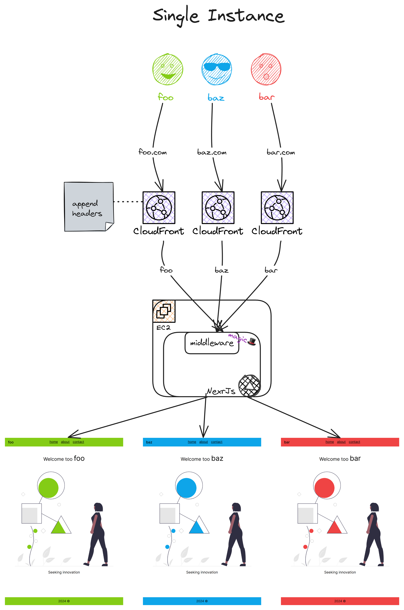

# NextJs Ultimate SaaS


[](https://www.linkedin.com/in/vinicius-zenha/)

<p align="center">

</p>

Have many clients in one single machine(or many)

## Why 🤔

The possibility to deploy all clients in one single vm is mainly about cost 💵, one NextJs machine can handle a lot of work and thus is optimal to start as a new product with a few clients.

Then when it grows you can finally give each client its own vm

## How 👨‍💻

The trick here is to use [middleware](https://nextjs.org/docs/app/building-your-application/routing/middleware) in conjunction with a `Header`
(e.g: X-App-Client) and use that to `mask` a [generic route](https://nextjs.org/docs/app/building-your-application/routing/dynamic-routes) with [redirect and rewrite](https://nextjs.org/docs/app/building-your-application/routing/middleware#nextresponse)

## Features 📃

-   Single deployment mode
-   Instances deployment mode
-   Ansible for deploy
-   Containerized Application
-   Github action to automate
-   Factories for each page
-   Theme context strategy
-   Chewed out scripts in Makefile

## Single vs Instances 🔗

These are the deployments mode of the application it affects the middleware and deploy pipeline behavior.

They will both check for `NEXT_PUBLIC_BUILD_TYPE` to chose how to behave

### Single:

The NextJs middleware will check for a `Header` `X-App-Client` and then rewrite the route to /[client]/about.
All the clients will share the same VM

### Instances:

The image will be built with a client bound to it so wherever you deploy it's going to work nicely
Each client will be deployed in it own VM

## Usage ☃️

You gonna need aws credentials

Take a look at `.env.example` then create your own `.env` with your own variables. Also create a github environment with them.

Change the theme in `src/ClientInterface.ts`

All you need for build, push, run, deploy is in `Makefile`

Also look for `foo baz bar` and change for the name of your clients

## [File tree 🌲](<https://tree.nathanfriend.io/?s=(%27options!(%27fancy!true~fullPath6~trailingSlash6~rootDot6)~B(%27B%27F3Jorkflows*..F%20actions3ansible-8%20...8src*appR%5Bc9%5DR05K4SINGLE*5s24INSTANCES*7RQsR05%207%20factories*middlewarHmagic*C9InterfacHc9KstrategyO%20routing%2C%20theming3Makefile2all%20you%20need%27)~version!%271%27)*300%20%202O-%203%5Cn4usedJhen%205...Q6!false7components8playbooks39lientBsource!F.githubHe.ts2J%20wKs%20O%20-QpageR*0%01RQOKJHFB987654320*>)

```
.github
└── workflows
    └── ...github actions
ansible-playbooks
└── ...playbooks
src
├── app
│   └── [client]
│       └── ...pages used when SINGLE
├── ...pages -- used when INSTANCES
├── components
│   └── pages
│       └── ...page components factories
├── middleware.ts -- magic
└── ClientInterface.ts -- clients strategy - routing, theming
Makefile -- all you need
```

## Architecture 🎨

### infra:




### base sketch


### layout showcase


